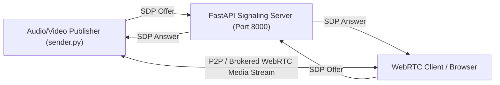
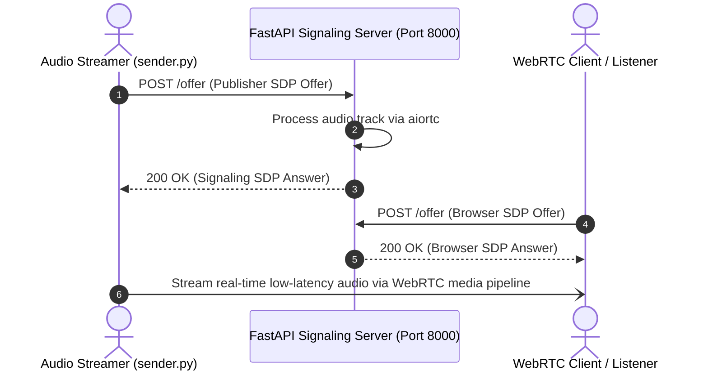

# WebRTC Signaling Server — Real-Time Audio & Video Gateway
[]()
[]()
[]()
[]()

## Overview
A high-throughput, low-latency WebRTC audio/video signaling gateway and media broker implemented in Python using FastAPI, aiortc, and WebSockets. Designed to handle SDP offer/answer handshakes, ICE candidate exchanges, and real-time audio track brokering for interactive broadcasts and peer-to-peer conferencing.

- **Problem Solved:** Low-latency WebRTC connection establishment and audio stream forwarding.
- **Target Users:** Streaming media developers, broadcast applications, and WebRTC clients.
- **Current Status:** Functional Python Signaling Server.

## Features
- **SDP Handshake Broker:** FastAPI endpoints for handling Session Description Protocol (SDP) offer/answer exchanges.
- **Asynchronous aiortc Engine:** High-performance async media pipeline handling audio frame transcoding.
- **Custom Audio Track Processor:** In-memory audio track buffering and forwarding (`audio_track.py`).
- **Containerization & Cloud Manifests:** Packaged with Dockerfile and Render cloud deployment specifications (`render.yaml`).

## Architecture


## User Flow


## Technology Stack
| Layer | Technology | Purpose |
|---|---|---|
| Language | Python 3.10+ | Asynchronous event loop execution |
| Framework | FastAPI, Uvicorn | High-speed async REST & WebSocket signaling |
| Media Core | aiortc, PyAV | WebRTC implementation and audio/video transcoding |
| Container | Docker, Render Cloud | Containerized cloud deployment |

## Infrastructure
- **Signaling Port:** 8000 (FastAPI HTTP / WebSocket)
- **Deployment Manifest:** `render.yaml`
- **Container Definition:** `Dockerfile`

## Project Structure
```text
WEBRTC/
├── backend/
│   ├── audio_track.py       # Custom AudioStreamTrack implementation
│   ├── requirements.txt     # Python dependencies (aiortc, fastapi, uvicorn)
│   ├── sender.py            # Stream ingestion and audio publishing client
│   └── server.py            # Main FastAPI signaling server
├── Dockerfile               # Container build instructions
├── render.yaml              # Render cloud hosting manifest
├── .gitignore               # Git ignore definitions
└── README.md                # Technical documentation
```

## Prerequisites
- Python >= 3.10
- FFmpeg and libav build dependencies (required for PyAV / aiortc)

## Environment Variables
Copy `.env.example` to `.env` and configure placeholders:
```env
PORT=8000
HOST=0.0.0.0
CORS_ORIGIN=*
```

## Local Development Setup
1. Clone the repository:
   ```bash
   git clone https://github.com/Bhanutejanallamothu/WEBRTC.git
   cd WEBRTC/backend
   ```
2. Create and activate a virtual environment:
   ```bash
   python -m venv venv
   source venv/bin/activate  # On Windows: venv\Scripts\activate
   ```
3. Install dependencies:
   ```bash
   pip install -r requirements.txt
   ```
4. Start signaling server:
   ```bash
   python server.py
   # Or: uvicorn server:app --reload --port 8000
   ```
5. Run publisher test in a second terminal:
   ```bash
   python sender.py
   ```

## Docker Setup
Build and run with Docker:
```bash
docker build -t webrtc-signaling .
docker run -p 8000:8000 webrtc-signaling
```

## Database Setup
*Not applicable. Signaling states are maintained in-memory during active sessions.*

## API Documentation
- `POST /offer` - Receives client SDP offer and returns server SDP answer.
- `GET /health` - Service healthcheck status.

## Deployment
Deploy to Render using `render.yaml` or AWS ECS / GCP Cloud Run using the `Dockerfile`.

## Security
- Validate SDP formats to prevent malformed payload exploits.
- In production, restrict CORS origin to authenticated client domains.

## Testing
Run signaling test loop:
```bash
python backend/sender.py
```

## Troubleshooting
- **aiortc PyAV Build Error:** Ensure FFmpeg development libraries are installed (`apt install libavformat-dev libavcodec-dev` on Linux).

## Future Improvements
- STUN/TURN server configuration (coturn) for NAT traversal across restrictive corporate firewalls.

## License
All rights reserved by repository owner.
